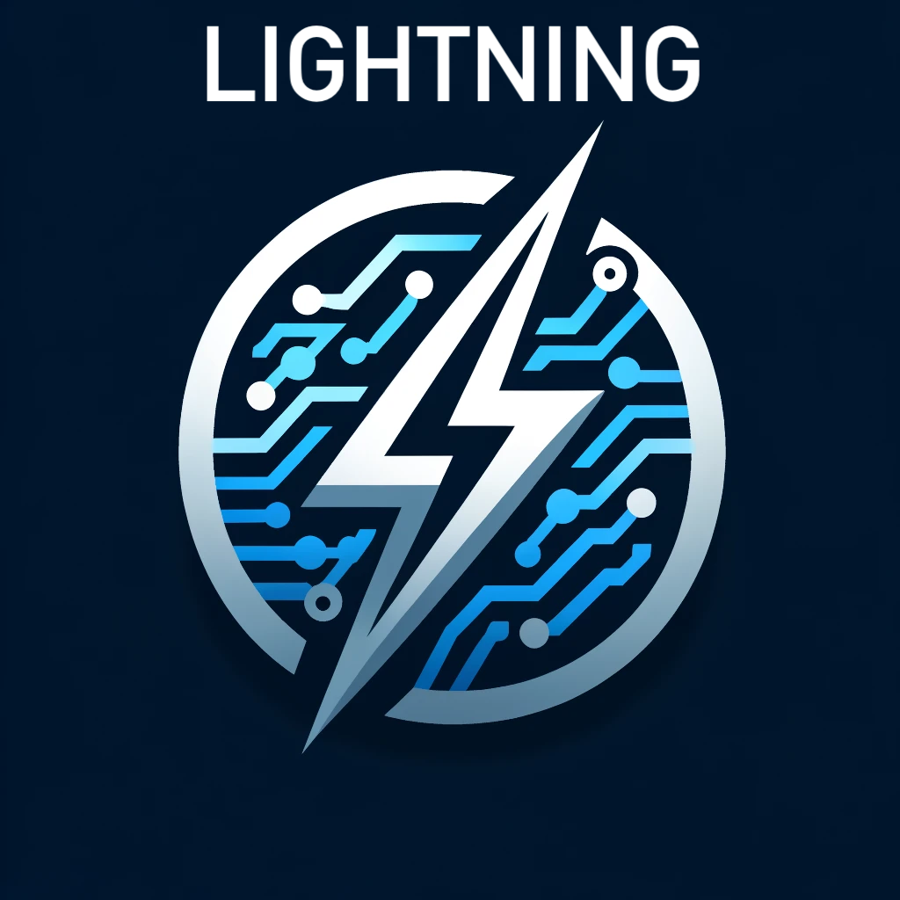

# Lightning Chatbot
## Supports Meta AI's new Llama 3 Model!
<p align="center">
  
</p>

[](https://github.com/yourusername/lightning-chatbot/stargazers)
[](https://github.com/yourusername/lightning-chatbot/issues)
[](https://github.com/yourusername/lightning-chatbot/pulls)
[](https://github.com/yourusername/lightning-chatbot/blob/main/LICENSE)

Lightning is an ultra-fast AI chatbot powered by Groq LPUs (Language Processing Units), offering one of the fastest inference speeds on the market as of April 2024. With its advanced natural language processing capabilities and lightning-fast response times, Lightning provides an unparalleled conversational experience.

## [Click here to try it out](https://lightning-ai.streamlit.app/)
## [Click here to try out the specialised Style Guide Assistant](https://lightningai-styleguide-assistant.streamlit.app/)
## Features

- ⚡ Ultra-fast inference powered by Groq LPUs
- 🎨 Customizable model selection and conversational memory length
- 💬 Seamless conversation history tracking
- 🌐 Easy deployment using Streamlit web framework


## Available Models
- 🦙 **Llama3-70B-8192**: Experience high-end performance with this large-scale model, ideal for complex language tasks and deep learning insights.
- 🦙 **Llama3-8B-8192**: Harness robust capabilities with this more accessible version of Llama3, perfect for a wide range of AI applications.
- 🌟 **Mixtral-8x7B-32768**: Leverage the power of ensemble modeling with Mixtral's extensive capacity for nuanced understanding and response generation.
- 🦙 **Llama2-70B-4096**: Utilize the proven effectiveness of Llama2 for comprehensive language processing and application development.
- 💎 **Gemma-7B-IT**: Explore specialized interactions and tech-focused solutions with Gemma, tailored for IT and technical content.


## Installation

1. Clone the repository:git clone https://github.com/MaxMLang/lightningfast-ai-chat.git
2. Navigate to the project directory: 
  ```
cd lightningfast-ai-chat
  ```
3. Install the required dependencies: 
```
pip install -r requirements.txt
  ```
4. Set up the Groq API key:

- Create a `.env` file in the project directory.
- Add the following line to the `.env` file, replacing `your_api_key` with your actual Groq API key:

  ```
  GROQ_API_KEY=your_api_key
  ```

5. Run the chatbot:
  ```
streamlit run app.py
  ```

6. Open the provided URL in your web browser to access the Lightning Chatbot interface.

## Usage

1. Choose a language model from the sidebar.
2. Adjust the conversational memory length using the slider in the sidebar.
3. Type your question or message in the input field and press Enter.
4. Lightning will generate a response using the selected model and display it in the chat interface.
5. Continue the conversation by entering more questions or messages.

## License

This project is licensed under the [MIT License](LICENSE).

## Acknowledgements

- [Groq](https://groq.com) for providing the lightning-fast LPUs.
- [Langchain](https://github.com/hwchase17/langchain) for the powerful language modeling capabilities.
- [Streamlit](https://streamlit.io) for the intuitive web framework.


